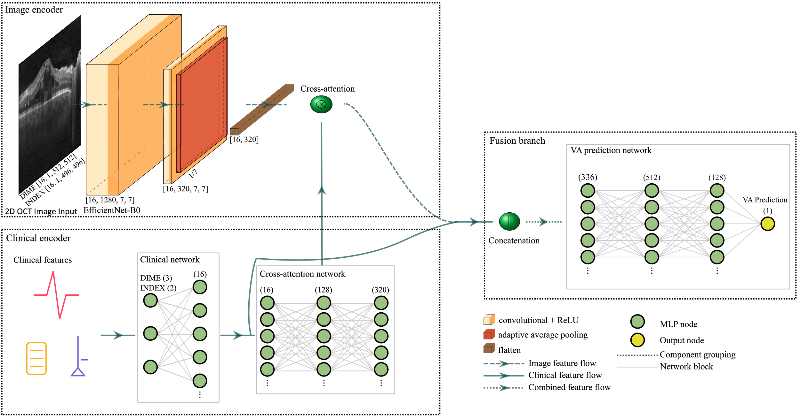

# Visual-Acuity-Prediction-with-Multi-Modal-Deep-Learning
Repo for code relating to the paper 'Enhancing Post-Treatment Visual Acuity Prediction with Multi-Modal Deep Learning on Small-scale Clinical and OCT Datasets'.



## Setup
To set up the environment for this project, use the `environment.yml` file to create a conda environment with the necessary dependencies by running `conda env create -f environment.yml`. Once the environment is created, activate it using `conda activate your-environment-name`. If you need to install any additional pip dependencies, you can use the `requirements.txt` file by running `pip install -r requirements.txt`. After completing these steps, your environment will be set up and ready to use.

## Model Training Scripts

The repository contains two main training scripts under the `scripts` folder:
- `train_DIME.py`: Training script for the DIME dataset
- `train_INDEX.py`: Training script for the INDEX dataset

### Running the Training Scripts

To run these scripts, first activate your conda environment:
```bash
conda activate your_environment_name
```
Then you can run either script using the following format:

DIME Training
```bash python
train_DIME.py \
--output_dir path/to/output \
--image_dir path/to/oct/images \
--clinical_data_path path/to/clinical_data.xlsx
```
INDEX Training
```bash python
train_INDEX.py \
--output_dir path/to/output \
--image_dir path/to/oct/images \
--clinical_data_path path/to/clinical_data.xlsx
```

### Optional Arguments
Both scripts accept the following optional arguments:
- `--batch_size`: Batch size for training (default: 16)
- `--image_size`: Size to resize images (default: 512)
- `--learning_rate`: Initial learning rate (default: 0.001)
- `--epochs`: Number of epochs to train (default: 100)
- `--seed`: Random seed (default: 42)

  
## Model Weights

The pre-trained model weights are stored in the `model_weights/` directory. Inside this directory, you will find subdirectories for each dataset: `DIME_weights/` and `INDEX_weights/`. Each folder contains the model weights for the 5 folds, stored as `best_model_fold_1.pt`, `best_model_fold_2.pt`, and so on.

To use the model weights, download the corresponding `.pt` file for the fold you are interested in, and load it using the PyTorch as follows:

```python
import torch
model = EfficientNetWithClinical()
model.load_state_dict(torch.load('model_weights/best_model_fold_1.pt'))
```

## License
This repository is licensed under the MIT License (See License Info). If you are intending to use this repository for commercial use cases, please check the licenses of all Python packages referenced in the Setup section / described in the `requirements.txt` and `environment.yml`.

## Citation
If you are using this code, please cite:
TBD
